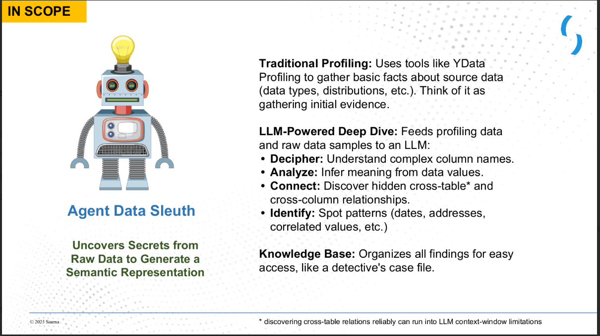
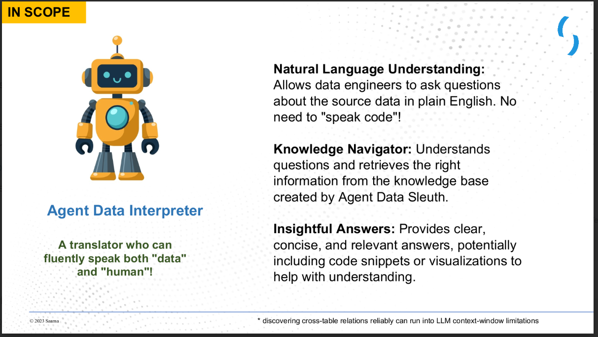
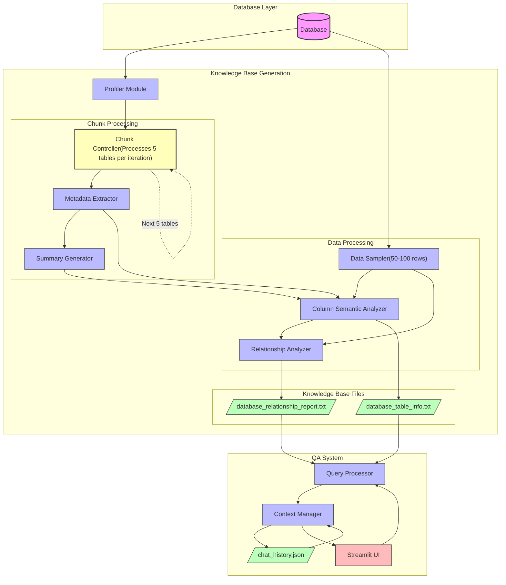

# Knowledge Base for the Database Project

This project is designed to create a comprehensive knowledge base for a database. It is divided into two main parts:  
1. **Creating the Knowledge Base** – Extracting and structuring metadata, generating insights, and understanding relationships among tables.
- 
2. **Q&A on the Knowledge Base** – Building an interactive Q&A interface using the generated knowledge base.
- 

---

## Part I: Creating the Knowledge Base

### Overview

The first phase of the project focuses on building a structured knowledge base from the database schema. The main tasks include:
- Extracting metadata and generating meaningful insights from each table.
- Handling token limitations when interacting with large amounts of data.
- Summarizing data and generating structured outputs that include table and column information.
- Analyzing relationships between tables (both inter- and intra-table).


#### System Architecture



### Step 1: Extracting Metadata and Generating Insights

- **Profiling the Database:**  
  - Initially, a profiler report is generated for all tables present in the schema. This report provides detailed metadata, such as column types, distributions, and sample values.
  
- **Filtering Profiler Data:**  
  - The entire profiler report is too large for the LLM (Large Language Model) to process directly.  
  - To overcome this, important variables are extracted from the profiler data, focusing on elements formatted as JSON/dict.  
  - This filtered output serves as the input for subsequent processing.


### Step 2: Summarizing the Profiler Report

- **Token Limit Challenges:**  
  - Directly passing the filtered report and data samples to the LLM still results in token overflow issues.
  
- **Summarization Approach:**  
  - A summarized version of the profiler report is generated, condensing all columns and tables into a concise overview.
  - This summary ensures that the LLM can process the input without exceeding token limits.

### Step 3: Generating Structured Metadata

- **Enhancing Column Information:**  
  - Some columns may have ambiguous names (e.g., `xpsvrur`) that do not immediately reveal their purpose.  
  - To derive meaningful interpretations, a sample of 50-100 rows is provided along with the summarized report to the LLM.
  
- **Structured Output Generation:**  
  - The LLM is tasked with generating a well-structured output containing metadata, table information, and the meaning behind column names.
  - **Challenge:** When the database grows larger, the structured metadata output tends to be truncated due to token limits.
  
- **Chunk-by-Chunk Processing:**  
  - To address this, the process is performed in chunks.  
    - The profiler report for the first 5 tables is sent to the LLM to generate a summary.
    - A sample data chunk corresponding to these 5 tables is then used to generate structured metadata.
    - This process is repeated for all tables.
  
- **Output Files:**  
  - The summarized report is stored as `{database_name}_summarized_report.txt`.
  - The structured metadata (table information) is stored as `{database_name}_table_info.txt`.

### Step 4: Analyzing Table Relationships

- **Relationship Extraction:**  
  - The summarized metadata and table information do not capture the relationships between tables.
  
- **Full Data Sample Requirement:**  
  - To determine both inter-table and intra-table relationships, a more comprehensive sample (50-100 rows) of the full database is passed to the LLM.
  - The generated relationship insights are stored in `{database_name}_relationship_report.txt`.

---

## Part II: Q&A on the Knowledge Base

### Overview

Once the knowledge base is built, the second part of the project enables interactive querying using a Q&A system. The key components include:

- **Knowledge Base Files:**  
  - The primary files used as the knowledge base are:
    - `table_info.txt`
    - `relationship_report.txt`

- **User Interface:**  
  - A simple Streamlit application is developed for the Q&A interface.
  - User queries interact with the knowledge base, and conversation history is maintained in `chat_history.json`.

### Running the Q&A Application

1. **Ensure Dependencies Are Installed:**
   ```bash
   pip install -r requirements.txt
   ```

2. **Launch the Streamlit Application:**
   ```bash
   streamlit run userinterface.py
   ```

3. **Interaction:**  
   - The Q&A system allows users to ask questions about the database.  
   - The responses are generated based on the structured metadata and relationship insights stored in the knowledge base files.

---

## How to Run the Project in Python

### Prerequisites

1. **Install Required Libraries:**
   ```bash
   pip install -r requirements.txt
   ```

2. **Setup Environment Variables:**

   Create a `.env` file with the following configuration (update the placeholders as needed):
   ```
   AZURE_ENDPOINT='your_azure_endpoint'
   AZURE_OPENAI_APIKEY='your_azure_openai_api_key'
   API_VERSION='2024-08-01-preview'
   GEMINI_API_KEY='your_gemini_api_key'
   MODEL='OPENAI'
   DB_HOST='your_db_host'
   DB_USER='your_db_user'
   DB_PASSWORD='your_db_password'
   DB_DATABASE='your_db_name'
   ```

   > **Note:**  
   > If you encounter any database connection issues, modify the function `convert_tables_to_dataframe` in the `helper.py` file according to your specific database schema.

### File Structure Description

- **helper.py:** Contains all helper functions needed for data extraction and processing.
- **main.py:** Implements the main pipeline of the project (i.e., creating the knowledge base).
- **llm_model.py:** Manages the connection and interaction with the LLM.
- **prompts.py:** Stores all prompts used to guide the LLM.
- **userinterface.py:** Provides the Streamlit-based UI for the Q&A system.

### Running the Pipeline

1. **Generate the Knowledge Base:**
   ```bash
   python main.py
   ```

2. **Once the Knowledge Base Is Ready:**  
   - Proceed to the Q&A system using the generated files (`table_info.txt` and `relationship_report.txt`).

3. **Launch the Q&A Application:**
   ```bash
   streamlit run userinterface.py
   ```

---

## Conclusion

This project demonstrates a robust approach to creating a database knowledge base using LLMs. Key highlights include:

- **Efficient Metadata Extraction:**  
  Utilizing a profiler report to gather detailed insights about the database schema.

- **Overcoming Token Limitations:**  
  Implementing summarization and chunk-by-chunk processing to manage large inputs.

- **Enhanced Data Understanding:**  
  Generating structured metadata that explains table and column meanings, even when column names are ambiguous.

- **Relationship Mapping:**  
  Extracting inter- and intra-table relationships by processing representative data samples.

- **Interactive Q&A System:**  
  Deploying a simple Streamlit application that leverages the knowledge base for user-friendly querying.

This systematic approach not only provides a clear understanding of the database structure but also facilitates easy interaction through a Q&A interface.
